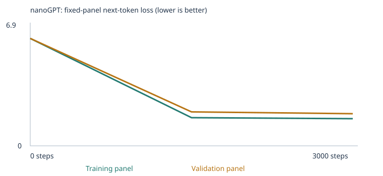
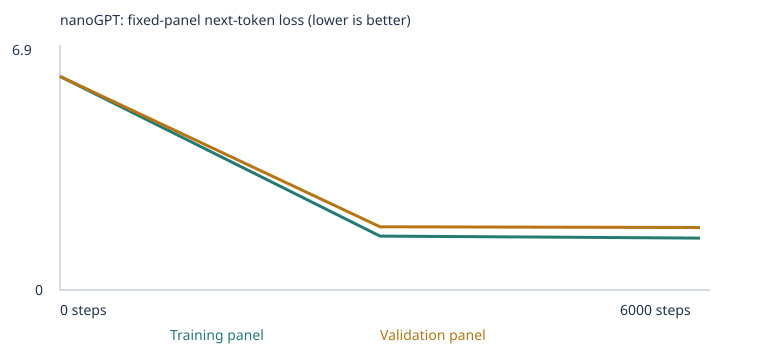
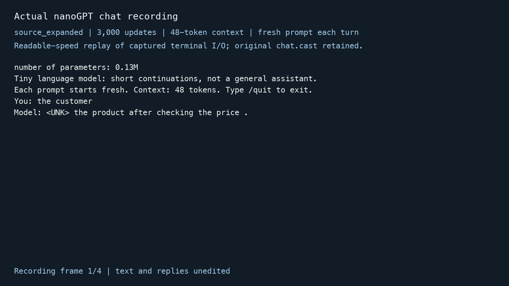

# Training a Tiny Language Model with Independent Teaching Sources

This revision trains the supplied nanoGPT on the classroom corpus and on classroom text plus two independently published books about **grammar** and **synonyms and antonyms**. The main trained models score **20/48** and **23/48** on the unchanged development suite. An executed 6,000-step source-corpus follow-up scores **24/48**. All three runs are saved, including failures and unrestricted continuations.

The central finding is that adding authentic teaching material does not automatically add usable vocabulary. The expanded model reaches its 512-token limit, including three special tokens, and replaces approximately 27% of corpus tokens with UNK. It improves the covered starter-pattern tests but leaves every extension test unscorable. This is a measured limitation, not a claim that the added books taught general language understanding.

## What changed after the classroom clarification

The original written assignment asked students to read the complete public evaluation suite. The assistant did so before writing the earlier synthetic extension. The September 22 classroom discussion emphasized learning from teaching material rather than including quiz questions in training, and also cautioned against selecting material from literal test items. The earlier [synthetic experiment report](SYNTHETIC_EXPERIMENTS.md) and its results remain available for transparency.

For this revision, the teaching text comes from complete independently authored books selected by subject. No custom teaching sentences were written from individual test items. The source plan and corpus were committed **before** training at commit `c924df9`. The prior exposure cannot be undone: this is still a **public development benchmark**, not blind evaluation or an untouched final test. Full result files are retained for assessment, but never used as teaching inputs.

AI assistance was used to choose subject-level sources, implement deterministic text preparation, execute experiments, audit artifacts and draft the technical explanation. This report documents actual observations; it does not claim that AI-generated prose demonstrates the student's personal mastery.

## Main evidence

- [Executed source baseline notebook](source_starter_custom_llm.ipynb)
- [Executed independently sourced expansion notebook](source_expanded_custom_llm.ipynb)
- [Executed 6,000-step follow-up notebook](source_expanded_6000_custom_llm.ipynb)
- [Plan and predictions before training](SOURCE_REVISION_PLAN.md)
- [Original book sources and hashes](source_materials/sources.json), [deterministic preparation code](prepare_source_corpus.py), and [preparation manifest](source_materials/preparation_manifest.json)
- [Actual chat recording](source_evidence/chat.cast), [viewable GIF](source_evidence/chat_recording.gif), and [three-turn transcript](source_evidence/chat_transcript.json)
- [Complete grading-evidence map](REQUIREMENTS_CHECK.md)

## Corpus choices and permissions

The starter uses the unchanged classroom sentence generator without imported teaching files. It makes domain associations and repeated sentence patterns easy to inspect. The two extension themes are grammar and opposite/contrasting meanings, both named by the assignment at the category level.

| Source | Authors | Topic and rationale | Corpus input |
|---|---|---|---|
| [Graded Lessons in English, Gutenberg 7010](https://www.gutenberg.org/ebooks/7010) | Alonzo Reed and Brainerd Kellogg | Independent explanations, sentence examples and exercises involving sentence structure, parts of speech and inflection; intended to supply grammatical contexts absent from the domain-only starter | [grammar_body.txt](corpus/source_expanded/grammar_body.txt) |
| [English Synonyms and Antonyms, Gutenberg 28900](https://www.gutenberg.org/ebooks/28900) | James Champlin Fernald | Independent word definitions, contrasts and examples; intended to add lexical relationships rather than repeat the starter's business/domain templates | [antonyms_body.txt](corpus/source_expanded/antonyms_body.txt) |

Both source pages identify these works as public domain in the USA. Complete downloaded editions, including their notices, are retained in [source_materials](source_materials). This project attributes the books and preserves their source notices. The original authors wrote the textbook prose; it is not presented as student-authored writing. The course-supplied network is [Karpathy's nanoGPT](https://github.com/karpathy/nanoGPT/blob/3adf61e154c3fe3fca428ad6bc3818b27a3b8291/model.py), with its [MIT license](NANOGPT_LICENSE). Classroom/helper source comes from [the course repository](https://github.com/pepealonso95/custom-llm), commit `9e04ddb6aacb8efcb790e70c62550ca55e0f2a75`.

The preprocessing uses each complete book body between the Gutenberg START and END markers. It removes italic underscores and the grammar edition's boldface plus markers, joins wrapped lines within paragraphs, and applies the original maximum 47-token passage splitter. It does not select entries by evaluation words, synthesize answers, manually extend the vocabulary, or revise text after seeing scores. Front matter, historical phrasing, diagram notation and the books' own exercises inside the body remain; these are source-text limitations.

The unchanged reserved-prefix check is a removal-only guardrail. It removed **zero** book passages; the regular classroom generator still excludes 160 reserved passages before splitting. The checker sees prefixes to reject exact overlap, but its answer key and generated outputs do not supply text to the corpus. The two full source files and prepared corpus files are hash-checked by the audit.

Source preparation retained 6,998 grammar chunks and 23,817 antonym chunks. The notebook re-applies its sentence/line splitter when importing the normalized files, yielding 8,157 and 24,841 imported passages respectively. The two-stage split explains the difference; it does not add teaching words. After deduplication and combination with the baseline, the extension contributes **24,715 new unique passages**, for **29,307 total**. Sources overlap and repeat passages, so per-file counts should not simply be added to get the final unique count. No PDF extraction or OCR was used. Both manifests report no file-reading warnings; source previews and hashes were inspected.

## Settings and prediction

Both main experiments use 3,000 updates and initial learning rate 0.001. These follow the assignment's CPU starting budget and keep the required comparison at the same update count. Batch size is 32; one step is one sampled-batch weight update, not a full pass through the corpus. The first 100 steps warm up, then cosine decay approaches one tenth of the initial rate. Too large a rate can destabilize updates; too small a rate can make little progress.

Before execution, the prediction was lower within-run training/validation loss but uncertain benchmark gains: the full textbooks might overwhelm the 509 ordinary-token cap. That concern was realized. The planned follow-up changes only the budget to 6,000 fresh updates; cosine duration changes as a consequence. It is not a checkpoint-resume experiment.

All runs use seed 42, CPU, two transformer blocks, four attention heads, 64-dimensional embeddings, context 48, zero dropout, and AdamW. The main comparison changes corpus content and therefore vocabulary, embedding shape, parameter count, split membership and random initialization realization. It is not a pure isolation of a single learned skill. Splits, panels and generation settings stay fixed **within each run**. The 6,000-step follow-up uses the exact expanded corpus, vocabulary, split and initial weights.

| Run | Unique passages | Train / validation | Vocabulary incl. special tokens | Train UNK | Validation UNK | Parameters | Updates | Training seconds |
|---|---:|---:|---:|---:|---:|---:|---:|---:|
| source_starter | 4,592 | 4,132 / 460 | 136 | 0.00% | 0.00% | 111,872 | 3,000 | 13.013 |
| source_expanded | 29,307 | 26,376 / 2,931 | 512 | 27.17% | 27.26% | 135,936 | 3,000 | 27.600 |
| source_expanded_6000 | 29,307 | 26,376 / 2,931 | 512 | 27.17% | 27.26% | 135,936 | 6,000 | 50.114 |

Runtime: macOS 26.6 ARM64, CPU with four PyTorch threads, Python 3.9.6 and PyTorch 2.8.0. Training seconds are measured loop time, excluding corpus preparation, setup and evaluations. All revised runs completed without interruption. An earlier environment setup error in the historical work required installing NumPy; it is included in requirements.txt.

The 90/10 split is by deduplicated passage, not book or linguistic template. Passages from the same book appear in training and validation. The held-out loss therefore does not establish generalization to new authors, new sources or unseen language structures.

**source_starter:** [config.json](llm_runs/source_starter/config.json) · [corpus_manifest.json](llm_runs/source_starter/corpus_manifest.json) · [vocabulary_report.json](llm_runs/source_starter/vocabulary_report.json) · [split.json](llm_runs/source_starter/split.json) · [training_summary.json](llm_runs/source_starter/training_summary.json) · [training.csv](llm_runs/source_starter/training.csv)

**source_expanded:** [config.json](llm_runs/source_expanded/config.json) · [corpus_manifest.json](llm_runs/source_expanded/corpus_manifest.json) · [vocabulary_report.json](llm_runs/source_expanded/vocabulary_report.json) · [split.json](llm_runs/source_expanded/split.json) · [training_summary.json](llm_runs/source_expanded/training_summary.json) · [training.csv](llm_runs/source_expanded/training.csv)

**source_expanded_6000:** [config.json](llm_runs/source_expanded_6000/config.json) · [corpus_manifest.json](llm_runs/source_expanded_6000/corpus_manifest.json) · [vocabulary_report.json](llm_runs/source_expanded_6000/vocabulary_report.json) · [split.json](llm_runs/source_expanded_6000/split.json) · [training_summary.json](llm_runs/source_expanded_6000/training_summary.json) · [training.csv](llm_runs/source_expanded_6000/training.csv)

## Four required evaluation result sets

The unchanged [suite](evals/language_evals.json) and [runner](run_evals.py) test all 48 cases before and after each main training run. Only the prefix is fed to the model. The key is used afterward by the scorer, not by training or the forward pass. A unique highest-probability correct choice among four words earns 1; wrong choices and ties earn 0. Cases with unknown prompt/choice tokens or excessive context are unscorable and receive zero in the all-case denominator. Scorable accuracy excludes those cases only in its separately labeled denominator.

| Run and stage | Correct / all | All-case success | Correct / scorable | Scorable accuracy | Coverage |
|---|---:|---:|---:|---:|---:|
| source_starter untrained | 9/48 | 18.75% | 9/24 | 37.50% | 24/48 (50.00%) |
| source_starter final | 20/48 | 41.67% | 20/24 | 83.33% | 24/48 (50.00%) |
| source_expanded untrained | 8/48 | 16.67% | 8/24 | 33.33% | 24/48 (50.00%) |
| source_expanded final | 23/48 | 47.92% | 23/24 | 95.83% | 24/48 (50.00%) |

**source_starter untrained:** [eval_results.json](llm_runs/source_starter/language_evals/untrained/eval_results.json) · [eval_results.csv](llm_runs/source_starter/language_evals/untrained/eval_results.csv) · [eval_summary.json](llm_runs/source_starter/language_evals/untrained/eval_summary.json) · [eval_cases.json](llm_runs/source_starter/language_evals/untrained/eval_cases.json)

**source_starter final:** [eval_results.json](llm_runs/source_starter/language_evals/final/eval_results.json) · [eval_results.csv](llm_runs/source_starter/language_evals/final/eval_results.csv) · [eval_summary.json](llm_runs/source_starter/language_evals/final/eval_summary.json) · [eval_cases.json](llm_runs/source_starter/language_evals/final/eval_cases.json)

**source_expanded untrained:** [eval_results.json](llm_runs/source_expanded/language_evals/untrained/eval_results.json) · [eval_results.csv](llm_runs/source_expanded/language_evals/untrained/eval_results.csv) · [eval_summary.json](llm_runs/source_expanded/language_evals/untrained/eval_summary.json) · [eval_cases.json](llm_runs/source_expanded/language_evals/untrained/eval_cases.json)

**source_expanded final:** [eval_results.json](llm_runs/source_expanded/language_evals/final/eval_results.json) · [eval_results.csv](llm_runs/source_expanded/language_evals/final/eval_results.csv) · [eval_summary.json](llm_runs/source_expanded/language_evals/final/eval_summary.json) · [eval_cases.json](llm_runs/source_expanded/language_evals/final/eval_cases.json)

### All groups and categories

Entries are **correct / total; scorable count**. Exact rates for every group/category are in the summaries. Zero scorable cases means scorable accuracy is undefined, not a lucky guess or proof of a skill. No cases are dropped.

| Group | Starter untrained | Starter trained | Books untrained | Books trained |
|---|---:|---:|---:|---:|
| extend_corpus | 0/24; 0 | 0/24; 0 | 0/24; 0 | 0/24; 0 |
| starter_patterns | 6/16; 16 | 16/16; 16 | 5/16; 16 | 16/16; 16 |
| starter_transfer | 3/8; 8 | 4/8; 8 | 3/8; 8 | 7/8; 8 |

| Category | Starter untrained | Starter trained | Books untrained | Books trained |
|---|---:|---:|---:|---:|
| categories_and_analogies | 0/3; 0 | 0/3; 0 | 0/3; 0 | 0/3; 0 |
| domain_context | 3/8; 8 | 8/8; 8 | 3/8; 8 | 8/8; 8 |
| domain_place | 3/8; 8 | 8/8; 8 | 2/8; 8 | 8/8; 8 |
| everyday_knowledge | 0/3; 0 | 0/3; 0 | 0/3; 0 | 0/3; 0 |
| grammar | 0/3; 0 | 0/3; 0 | 0/3; 0 | 0/3; 0 |
| negation | 0/3; 0 | 0/3; 0 | 0/3; 0 | 0/3; 0 |
| new_wording | 3/8; 8 | 4/8; 8 | 3/8; 8 | 7/8; 8 |
| opposites | 0/3; 0 | 0/3; 0 | 0/3; 0 | 0/3; 0 |
| reference | 0/3; 0 | 0/3; 0 | 0/3; 0 | 0/3; 0 |
| sequence | 0/3; 0 | 0/3; 0 | 0/3; 0 | 0/3; 0 |
| spatial_relations | 0/3; 0 | 0/3; 0 | 0/3; 0 | 0/3; 0 |

### Interpretation and failure analysis

The same 24 starter/transfer cases remain scorable in both main runs. Training raises the starter score from 9 to 20 and the book-expanded score from 8 to 23. Between trained models, domain cases remain 16/16; transfer cases rise from 4/8 to 7/8. Because the scorable set stays the same, this three-case net improvement is not a coverage gain. It is descriptive evidence from one seed, not a statistically established general improvement.

**Neither intended extension category becomes scorable.** Grammar and opposites teaching material was added, but the broad books consume the limited vocabulary. The most frequent 509 training types are retained; infrequent words are discarded even when they occur in the books. For example, `lang_25` is unscorable because required words are absent from the retained vocabulary, and `lang_28` is likewise blocked by multiple omitted words. These IDs identify saved failures without using their question text as new teaching material. The 3,000-step model also fails the fully scorable transfer case `lang_19`, so vocabulary is not the only limitation.

A larger corpus increases data volume but also vocabulary diversity and the number of passages competing for the same 3,000-update budget. The experiment therefore shows why adding whole books may be ineffective for a tiny capped word tokenizer. It does not demonstrate successful acquisition of grammar or antonym reasoning. Training and held-out UNK rates around 27% and the unchanged 50% evaluation coverage substantiate this explanation. Exact OOV lists remain in the complete result files; no words were inserted directly into the vocabulary to repair tests.

The unrestricted continuation is sampled separately at temperature 0.8, per-case seed 2026 plus the case index, and a 24-token output limit. Its text is not the four-choice score. Actual continuations below come from the saved runner outputs; all remaining strings, including empty strings, remain in the full result sets.

| Run and stage | Case | Status | Choice score | Actual free continuation |
|---|---|---|---:|---|
| source_starter untrained | lang_01 | scored | 0 | `pear professor item doctor course harvest team physician journey checking buyer delivery our report the lecturer item offering and system <UNK> taste recommended payment` |
| source_starter final | lang_01 | scored | 1 | `service in detail .` |
| source_expanded untrained | lang_01 | scored | 0 | `it if pupils well speech ) 2 client water learning commonly rule him under result term men person etc tho most is exercise focused` |
| source_expanded final | lang_01 | scored | 1 | `order of service .` |
| source_expanded final | lang_19 | scored | 0 | `the <UNK> .` |
| source_expanded final | lang_25 | out_of_vocabulary | 0 | `and they <UNK> ; <UNK> will be <UNK> of that <UNK> .` |
| source_expanded final | lang_28 | out_of_vocabulary | 0 | `often of <UNK> or <UNK> , but may be <UNK> ; in the <UNK> from <UNK> , but <UNK> <UNK> has a <UNK> .` |

The source-based 3,000-step model is the chat model selected for the main comparison. The subsequent 6,000-step run is reported separately; no best-run replacement or removal of failures is used.

## Evaluation separation and source provenance

`CORPUS_FOLDER` is `corpus/starter` or `corpus/source_expanded`, never the repository root. Original books and notices live in `source_materials`; evaluation JSON lives in `evals`; output, transcript and report folders stay outside the selected corpus. None of the earlier AI-authored extension files are imported by the source revision.

The fixed suite file SHA-256 remains `e8affcd72841e3ed7da5c0b6b116327fe9f69c9abd66a1180d1d88ceaa3e17f7`. The runner's parsed-JSON suite hash is `1d7c503f34d88260d0ac897bc36b8ba621cccc1950aef47e7121e69b2c1c9e1d`; these are different representations of the same suite. Model/helper files are unchanged and hash-checked. The book sources and prepared text have their own hashes and a reproducible source-to-corpus transformation.

Exact-prefix matching is not a semantic leakage detector. Natural shared words, linguistic facts and ordinary textbook exercises are expected. Retaining source provenance and the complete processing rule makes the origin inspectable; it does not erase prior public-benchmark exposure or prove an untouched final test.

[source_starter separation](llm_runs/source_starter/eval_separation.json) · [source_expanded separation](llm_runs/source_expanded/eval_separation.json) · [source_expanded_6000 separation](llm_runs/source_expanded_6000/eval_separation.json)

## How the model learns from actual evidence

The **corpus** is the teaching text collection. Here a **token** is a lowercase word or punctuation mark. An **ID** selects a row in the vocabulary table; the ID is not a semantic quantity. A **vector** is a list of coordinates, and a token **embedding** is a learned 64-number vector. BOS begins a passage, EOS stops generation, and UNK replaces unavailable vocabulary words. Shifted input/target arrays in tokenization.json implement prediction of the next token from earlier tokens.

The network contains token and position embeddings, attention projections, nonlinear feed-forward layers and other learned weights. Causal attention forms query/key scores, masks future positions, applies softmax, and combines value vectors from current/earlier positions. Its saved first-head attention matrix illustrates context mixing, not a universal explanation of the network. Logits from the final hidden state become vocabulary probabilities through softmax; generation samples one token and repeats until EOS or the output limit.

The loss is mean negative log probability assigned to observed next-token targets, ignoring padding. Backpropagation computes derivatives with respect to the weights. The code records a real embedding gradient, clips total gradient norm to 1, then AdamW updates parameters using adaptive scaling, momentum and weight decay. The raw saved gradient is before clipping; an AdamW update is not simply negative learning rate times the raw gradient.

### source_starter inspection

Word `customer` maps to ID **28**, row 28 of a **136 × 64** table. The ID remains an index while the coordinates learn. [tokenization.json](llm_runs/source_starter/tokenization.json) contains an actual passage and shifted token IDs; [inspection.json](llm_runs/source_starter/inspection.json) contains the full precision vectors, update and probability distributions.

Before training — all 64 coordinates, rounded to eight decimals:

```text
-0.05759192, -0.00480995, 0.04263189, 0.01933896, 0.01564311, -0.02882436, 0.02560906, 0.00005245
0.02470682, 0.02069177, 0.00736902, -0.03308962, -0.05354787, -0.00574293, -0.02416676, -0.01471612
0.00468571, -0.01045427, -0.00838108, -0.01825856, -0.02013370, 0.00509864, -0.01091650, -0.01263335
0.02838963, -0.00263122, -0.00407193, 0.01364192, -0.00989172, -0.01671763, 0.00190608, -0.00145350
0.01602652, -0.00567488, -0.00067235, -0.00129073, -0.00731947, -0.00093071, 0.00150763, -0.00497664
-0.02898702, 0.01809299, -0.00734801, -0.00544025, 0.01564120, -0.00454351, 0.04156794, 0.05235543
0.02264269, -0.01541428, -0.02512120, -0.00679746, 0.02935275, -0.00253368, 0.02980123, -0.02279700
-0.03023791, 0.00643679, 0.05049081, 0.00749100, -0.01072286, 0.02473733, -0.01446874, 0.01323592
```

After training — all 64 coordinates, rounded to eight decimals:

```text
0.03662532, -0.01821609, 0.13302672, 0.10595220, 0.06301495, 0.01891359, 0.15230250, 0.09290945
-0.06321926, -0.01725521, 0.03409860, -0.04738450, -0.06455117, -0.08658680, -0.14499153, -0.03588495
-0.15690985, -0.15027744, -0.00762369, -0.07074484, -0.09301440, 0.00910641, -0.06480718, 0.01752572
0.00392175, -0.06245314, 0.11251994, -0.06433097, 0.05204726, -0.15667436, -0.07061607, 0.06167873
-0.03177210, 0.14139567, 0.09131175, 0.05647165, 0.01960998, -0.13483678, 0.12228415, -0.03383190
0.11874091, 0.00457498, -0.13443385, 0.05294327, -0.03759470, -0.10312022, 0.02026831, 0.03811930
-0.01983956, -0.15073812, 0.03027874, -0.12055264, 0.01661724, 0.07775252, 0.11809076, 0.05573463
0.09336104, 0.00261987, 0.03705694, 0.07563242, 0.11852193, 0.01437565, 0.09128829, -0.07461116
```

First update of coordinate 0: **-0.057591915131 → -0.057601906359**, raw gradient **0.000692586764**, effective warmup rate **0.00001000**, observed delta **-0.000009991229**. This is the real network update, not just the scalar derivative illustration.

For the inspection prefix `the customer`, probability of `reviewed` changes from **0.00711145** to **0.17824928**. It is a model prediction, not proof that the generated answer is true.

Full-vector cosine neighbors before: bus (0.213), educator (0.203), helped (0.202), bank (0.201), risk (0.198). After: shopper (0.978), client (0.977), buyer (0.977), subscriber (0.971), consumer (0.970). Shared contexts can create similarity, but this is not a human dictionary of meaning. The viewer uses a lossy PCA projection; cosine comparisons use all 64 dimensions. Load [checkpoint.json](llm_runs/source_starter/checkpoint.json) in [embedding-viewer.html](embedding-viewer.html).
### source_expanded inspection

Word `customer` maps to ID **115**, row 115 of a **512 × 64** table. The ID remains an index while the coordinates learn. [tokenization.json](llm_runs/source_expanded/tokenization.json) contains an actual passage and shifted token IDs; [inspection.json](llm_runs/source_expanded/inspection.json) contains the full precision vectors, update and probability distributions.

Before training — all 64 coordinates, rounded to eight decimals:

```text
-0.01289048, -0.00112426, 0.01111397, -0.01921914, 0.01805574, -0.00295553, -0.01667393, -0.01402552
-0.03325626, 0.04368388, 0.00337062, 0.05887846, -0.01349128, -0.02134749, -0.00064969, 0.02944676
-0.01939894, 0.00828245, 0.02731836, -0.02722235, 0.00871754, -0.01180333, 0.01417540, 0.05519300
-0.02379494, -0.03059601, -0.01351290, -0.01288646, -0.03714879, -0.01525916, 0.01388452, 0.01599167
0.01030977, -0.01079112, -0.00009699, -0.01862323, 0.01763575, -0.00238881, 0.01185264, 0.03396032
-0.00449775, 0.00677474, -0.00498336, -0.01261429, 0.00303682, -0.02810409, -0.02002282, 0.00653098
-0.01906627, -0.02612402, -0.02332061, 0.02224589, -0.00822589, -0.00511698, -0.03225655, 0.02354597
-0.03103489, -0.02494293, 0.01422724, -0.02508107, -0.03373867, -0.01668371, -0.01875169, 0.01738167
```

After training — all 64 coordinates, rounded to eight decimals:

```text
-0.10836834, -0.14590615, 0.00745096, -0.10813475, 0.00653572, -0.03838060, -0.20501490, 0.03112205
0.10382409, 0.00442746, -0.07999310, 0.11599053, -0.10950269, 0.09662868, -0.06624954, -0.01128119
0.16088724, -0.10437444, -0.08151703, -0.17501110, 0.15836324, -0.07261769, -0.02145714, 0.13894971
0.23622346, -0.08933853, 0.01525367, -0.08525939, 0.00035176, -0.12328471, -0.10510342, 0.17430764
0.02544928, -0.14953060, 0.07477849, -0.12189068, -0.05046105, 0.05009597, -0.07420538, 0.07361405
-0.03905376, -0.04495563, 0.07816980, -0.01672847, 0.08787115, -0.13982020, 0.02651188, 0.22479023
0.10706118, 0.12342249, 0.14552456, -0.18066512, -0.10177252, -0.18859789, 0.09051426, 0.17937161
0.18965079, -0.20279402, 0.11077007, 0.11941115, -0.22308519, 0.02654248, 0.08697922, -0.07711199
```

First update of coordinate 0: **-0.012890481390 → -0.012880485505**, raw gradient **-0.000055456298**, effective warmup rate **0.00001000**, observed delta **0.000009995885**. This is the real network update, not just the scalar derivative illustration.

For the inspection prefix `the customer`, probability of `<UNK>` changes from **0.00195191** to **0.88698047**. It is a model prediction, not proof that the generated answer is true.

Full-vector cosine neighbors before: group (0.321), animal (0.311), fruit (0.307), write (0.307), security (0.294). After: client (0.987), buyer (0.985), subscriber (0.983), consumer (0.977), shopper (0.975). Shared contexts can create similarity, but this is not a human dictionary of meaning. The viewer uses a lossy PCA projection; cosine comparisons use all 64 dimensions. Load [checkpoint.json](llm_runs/source_expanded/checkpoint.json) in [embedding-viewer.html](embedding-viewer.html).
## Complete loss measurements and sample timelines

Each run uses fixed panels of **20 training and 20 validation documents**. Values average all non-padding next-token targets in each panel. They are small panel estimates, not full-corpus measurements. All fixed-panel values are listed; intermediate printed batch losses are different measurements. The added books change the vocabulary, corpus and selected panels, so the two main runs' absolute losses should not be ranked as comparable benchmarks.

For every sample stage, the starting token is BOS, seed is 2026, temperature is 0.8, count is four, and output limit is 32 tokens. All saved strings are shown, including disordered and UNK-heavy outputs.

### source_starter loss and samples


| Step | Training panel loss | Validation panel loss |
|---:|---:|---:|
| 0 | 4.926252365 | 4.927547932 |
| 1500 | 0.682139337 | 0.718243241 |
| 3000 | 0.678312540 | 0.706135690 |

Full precision: [history.json](llm_runs/source_starter/history.json) and [training.csv](llm_runs/source_starter/training.csv).

**Step 0** — [complete sample file](llm_runs/source_starter/samples/step_0000.txt)

```text
1. pear professor bond doctor course harvest team physician journey checking buyer delivery traffic report the lecturer item offering and system <UNK> taste recommended mentioned bus question customer at mortgage nurse in instructor
2. kitchen purchase journey product question discussion journey service . nurse local
3. compared and purchase update mortgage question loan taste in market treatment learned another item bicycle product bicycle focused data and dentist recommended mango apple taxi bicycle delivery peach quality update student lesson
4. important hospital juice patient return recommended deposit tutor returned understand kitchen student design ordered hospital treatment important package traffic with yesterday investment important of mentioned store ordered mortgage nurse shopper the station
```

**Step 1500** — [complete sample file](llm_runs/source_starter/samples/step_1500.txt)

```text
1. our school has a question about the new educator and lesson .
2. a review of risk helped us understand the different deposit .
3. we learned about the important website during a discussion of data .
4. our school has a question about the different instructor and course .
```

**Step 3000** — [complete sample file](llm_runs/source_starter/samples/step_3000.txt)

```text
1. our school has a question about the new educator and lesson .
2. a review of risk helped us understand the different deposit .
3. the report about the nurse explains the health in detail .
4. the consumer compared the offering after checking the price .
```
### source_expanded loss and samples



| Step | Training panel loss | Validation panel loss |
|---:|---:|---:|
| 0 | 6.229711533 | 6.229967594 |
| 1500 | 1.631640911 | 1.968184829 |
| 3000 | 1.574097395 | 1.863475323 |

Full precision: [history.json](llm_runs/source_expanded/history.json) and [training.csv](llm_runs/source_expanded/training.csv).

**Step 0** — [complete sample file](llm_runs/source_expanded/samples/step_0000.txt)

```text
1. it if pupils well speech station 2 client water learning commonly either him under result term men person etc tho most is exercise focused merely complement 3 desire own fine real purpose
2. them use payment new make purpose could especially less well taste fruit discussion orange learned find toward group kind sound educator point does letter phrase we men learning do same from student
3. following break more bad pain detail himself pronoun meaning return then physician discussed little pronoun heart one's have fancy case health money 2 body absolute sometimes but different battle us than delivery
4. express come but add complete way it case being simple an rather payment matter above influence full who limited set the ( which no store in have always thought moral code more
```

**Step 1500** — [complete sample file](llm_runs/source_expanded/samples/step_1500.txt)

```text
1. it is <UNK> a <UNK> <UNK> for a <UNK> .
2. what is <UNK> ?
3. <UNK> .
4. <UNK> , <UNK> " <UNK> , <UNK>
```

**Step 3000** — [complete sample file](llm_runs/source_expanded/samples/step_3000.txt)

```text
1. it is <UNK> to <UNK> <UNK> , but he was <UNK> .
2. <UNK> is the <UNK> <UNK> of <UNK> <UNK> <UNK> .
3. <UNK> , <UNK> , <UNK> , <UNK> , <UNK> , <UNK> , <UNK> , <UNK> , <UNK> , <UNK> .
4. <UNK> is <UNK> than <UNK> <UNK> .
```

Within each run both losses decrease, but the source-expanded validation loss remains noticeably above training loss. Template-like starter fluency and textbook-like punctuation patterns can appear while many content words remain UNK. This is consistent with learning parts of the narrow training distribution; it does not show reliable instruction following or broad generalization. A model can lower loss partly by learning frequent UNK transitions, so lower loss alone is especially insufficient here.

## Temperature comparison

All temperatures use the same final weights, BOS, seed 2026 and 32-token limit. Lower temperature sharpens probabilities; higher temperature spreads them more widely. This changes inference, not the weights or retained vocabulary. It cannot reconstruct words mapped to UNK. A sampled sentence may remain identical at different temperatures under a fixed seed.

**source_starter** — [temperature_comparison.json](llm_runs/source_starter/temperature_comparison.json)

Temperature 0.3:

```text
1. our school has a question about the new educator and lesson .
2. a review of risk helped us understand the different investment .
3. the report about the nurse explains the health in detail .
4. the local consumer was mentioned in the purchase report yesterday .
```

Temperature 0.8:

```text
1. our school has a question about the new educator and lesson .
2. a review of risk helped us understand the different deposit .
3. the report about the nurse explains the health in detail .
4. the consumer compared the offering after checking the price .
```

Temperature 1.2:

```text
1. our school has a question about the new educator and lesson .
2. a review of risk helped us understand the different deposit .
3. the report about the nurse explains the health in detail .
4. the consumer compared the offering after checking the price .
```
**source_expanded** — [temperature_comparison.json](llm_runs/source_expanded/temperature_comparison.json)

Temperature 0.3:

```text
1. <UNK> , <UNK> , <UNK>
2. <UNK> , <UNK> , <UNK>
3. <UNK> , <UNK> , <UNK>
4. <UNK> , <UNK> , <UNK>
```

Temperature 0.8:

```text
1. it is <UNK> to <UNK> <UNK> , but he was <UNK> .
2. <UNK> is the <UNK> <UNK> of <UNK> <UNK> <UNK> .
3. <UNK> , <UNK> , <UNK> , <UNK> , <UNK> , <UNK> , <UNK> , <UNK> , <UNK> , <UNK> .
4. <UNK> is <UNK> than <UNK> <UNK> .
```

Temperature 1.2:

```text
1. it of <UNK> a <UNK> <UNK> 2 ; he was <UNK> .
2. <UNK> is the <UNK> person or <UNK> of <UNK> when he <UNK> tho is come to fine real purpose them ; one , make purpose could not less well taste <UNK> .
3. this is <UNK> than i <UNK> .
4. what does <UNK> to <UNK> or <UNK> ?
```
## Executed follow-up with 6000 updates

The prespecified follow-up uses the same source corpus, split, vocabulary, panels, initialization seed and starting learning rate, with a fresh 6,000-update training budget. The changed cosine duration is a consequence of that budget setting. The model is not resumed from the 3,000-step checkpoint.

| Stage | Correct / all | All-case success | Scorable accuracy | Coverage |
|---|---:|---:|---:|---:|
| untrained | 8/48 | 16.67% | 33.33% | 24/48 |
| final | 24/48 | 50.00% | 100.00% | 24/48 |



| Step | Training loss | Validation loss |
|---:|---:|---:|
| 0 | 6.229711533 | 6.229967594 |
| 3000 | 1.571052551 | 1.843068480 |
| 6000 | 1.514449716 | 1.821400762 |

The follow-up improves the score from 23 to 24 correct by fixing the remaining covered transfer case `lang_19`. Coverage remains **24/48** and all 24 extension cases remain unscorable. The apparently perfect **100% scorable accuracy** is only **50% all-case success**. It does not mean all tests were passed or that the target extension skills were acquired. Longer training reduced validation loss from 1.863475 to 1.821401 but did not remove the vocabulary bottleneck.

Follow-up untrained: [eval_results.json](llm_runs/source_expanded_6000/language_evals/untrained/eval_results.json) · [eval_results.csv](llm_runs/source_expanded_6000/language_evals/untrained/eval_results.csv) · [eval_summary.json](llm_runs/source_expanded_6000/language_evals/untrained/eval_summary.json)

Follow-up final: [eval_results.json](llm_runs/source_expanded_6000/language_evals/final/eval_results.json) · [eval_results.csv](llm_runs/source_expanded_6000/language_evals/final/eval_results.csv) · [eval_summary.json](llm_runs/source_expanded_6000/language_evals/final/eval_summary.json)

Full follow-up inspections and samples: [history.json](llm_runs/source_expanded_6000/history.json) · [inspection.json](llm_runs/source_expanded_6000/inspection.json) · [tokenization.json](llm_runs/source_expanded_6000/tokenization.json) · [samples/step_0000.txt](llm_runs/source_expanded_6000/samples/step_0000.txt) · [samples/step_3000.txt](llm_runs/source_expanded_6000/samples/step_3000.txt) · [samples/step_6000.txt](llm_runs/source_expanded_6000/samples/step_6000.txt) · [temperature_comparison.json](llm_runs/source_expanded_6000/temperature_comparison.json).

A **future proposed experiment**, not a claimed result, is to change only the retained-vocabulary cap on this frozen source corpus and repeat both untrained/final evaluation. That would test the measured vocabulary bottleneck without writing examples from benchmark questions. The larger embedding table and different initialization shape would need to be disclosed, and absolute losses would no longer be directly comparable. New reserved probes chosen before tuning would be needed for an unseen-generalization claim. The 6,000-step budget experiment above is already executed, distinct from this proposal.

## Working chat with the saved source model

The unmodified [chat.py](chat.py) loads `llm_runs/source_expanded/model.pt` and the vocabulary stored with it. It generates from the trained nanoGPT; it uses no other model API or canned responses. Every prompt starts fresh, unknown words are reported, and only the most recent 48 context tokens are used for long prompts. Chat never adds examples to the corpus or updates weights. The embedding-viewer checkpoint is not an inference model.

Three actual terminal turns were captured by [record_source_chat.py](record_source_chat.py). The transcript includes the model identity and completed steps. All outputs are retained:

```text
number of parameters: 0.13M
Tiny language model: short continuations, not a general assistant.
Each prompt starts fresh. Context: 48 tokens. Type /quit to exit.
You: the customer
Model: <UNK> the product after checking the price .
You: a cat
Model: is <UNK> in the <UNK> it in its <UNK> of a <UNK> ; <UNK> of <UNK> <UNK> <UNK> , a <UNK> ; as ,
Unknown words: cat
You: explain quantum teleportation
Model: .
Unknown words: explain, quantum, teleportation
You: /quit
Saved transcript: source_evidence/chat_transcript.json
```

Model hash: `f9ae30b1b049d8cdc1c96a25e6073be827571ad4d6a6769e139f8bf076c57e06`. The first response retains a recognizable classroom structure but contains UNK; the second also reports an unknown prompt word; the third produces only punctuation for an unsupported request. These are genuine interface failures, not missing UI functionality, and are not represented as meaningful answers.



This GIF renders the unchanged captured terminal I/O at a readable pace; it is not a screenshot of a Terminal window. [Original timestamped recording](source_evidence/chat.cast) · [JSON transcript](source_evidence/chat_transcript.json) · [plain terminal output](source_evidence/chat_terminal.txt) · [still frame](source_evidence/chat_recording_still.png). Replay the original with `asciinema play source_evidence/chat.cast` if installed. The [conversion source](render_source_chat_recording.py) requires Pillow only for rendering evidence, not training or chat.

## Reproduce and verify

Clone or download this repository, then from its root:

```bash
python3 -m venv .venv
source .venv/bin/activate
python -m pip install -r requirements.txt
python -m ipykernel install --prefix .venv --name custom-llm --display-name "Custom LLM"
jupyter notebook
```

Open the two main source notebooks linked above and select the Custom LLM kernel. Executed outputs are already visible. Run All automatically uses a new timestamped result directory when the submitted one exists, preserving original evidence. All inputs are included; no API key, pretrained weights or extra corpus download is required. The source preparation can be independently rerun with `python prepare_source_corpus.py`; source hashes must match before processing.

For notebook execution without opening the UI:

```bash
python reproduce.py --experiment all --kernel custom-llm
```

This executes source_starter, source_expanded and source_expanded_6000, writing new `reproduced_*.ipynb` files at the repository root and new run folders. A working default Python kernel can be used by omitting the kernel argument. Exact numerical reproducibility can depend on hardware and dependency versions; [the recorded environment](evidence/execution_environment.txt) identifies the original training setup.

Launch the saved source model:

```bash
python chat.py --model llm_runs/source_expanded/model.pt --transcript my_chat.json
```

Type prompts at `You:` and `/quit` to finish. Use a fresh transcript filename each time. Both model.pt and model_untrained.pt are included in every run folder. They store inference weights, not optimizer state for exact training resume.

Rerun the four required evaluation sets from saved checkpoints:

```bash
python run_evals.py --model llm_runs/source_starter/model_untrained.pt --stage untrained --output results/source_starter_untrained
python run_evals.py --model llm_runs/source_starter/model.pt --stage final --output results/source_starter_final
python run_evals.py --model llm_runs/source_expanded/model_untrained.pt --stage untrained --output results/source_expanded_untrained
python run_evals.py --model llm_runs/source_expanded/model.pt --stage final --output results/source_expanded_final
```

The same runner loads the 6,000-step checkpoint. All six revised saved-model reruns were executed and produced exactly matching per-case records, including free continuations: [verification report](source_evidence/rerun_verification.json). Use new output folders to keep earlier evidence.

```bash
python verify_submission.py
python -m unittest test_language_evals test_corpus
```

[The audit](verify_submission.py) checks source hashes, all notebook execution outputs, fixed suites, 288 case/stage records, model identities, vector/weight consistency, disjoint train/validation membership, fixed panels, corpus prefix separation, ZIP contents, chat identity and README file links. [Audit report](source_evidence/detailed_audit.json). The original 14 corpus/evaluation tests passed; their log is [retained](evidence/unit_tests.txt). Their intentionally invalid-PDF fixtures do not mean these TXT-only runs had extraction errors.

## Complete results and historical work

[Revised starter ZIP](llm_runs/source_starter.zip) · [Independent-source expansion ZIP](llm_runs/source_expanded.zip) · [Source follow-up ZIP](llm_runs/source_expanded_6000.zip)

The ZIPs contain the complete run artifacts. The executed notebooks are separate files at the top of this report. [Earlier synthetic experiments](SYNTHETIC_EXPERIMENTS.md) remain clearly labeled historical; their higher score is not substituted for the source-based result. All source files, selected corpus paths and experiment identities remain inspectable.

