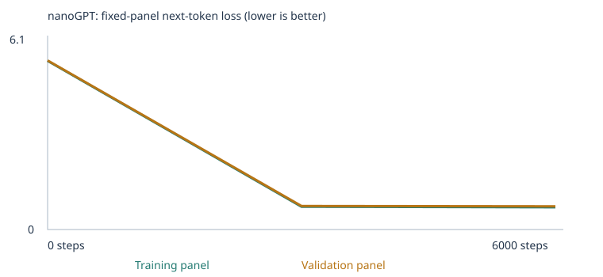
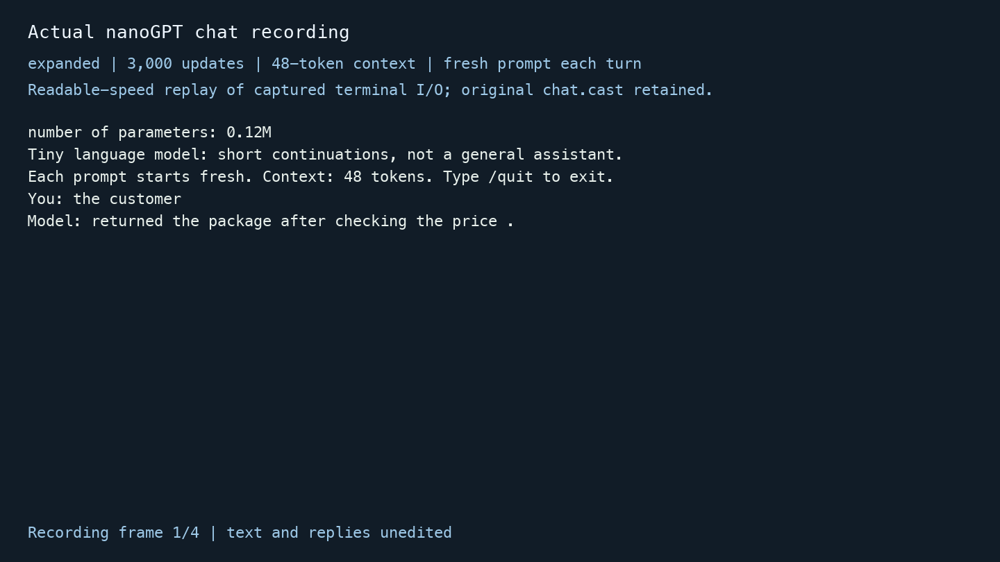

# Earlier synthetic extension experiments

**Historical report, retained for transparency.** This version used AI-authored examples after the assistant had read the fixed suite, as the original written assignment requested. Following the September 22 classroom clarification, the independently sourced revision in [README.md](README.md) is the primary submission. These original results are not deleted or relabeled as blind evaluation.

# Building and Evaluating a Tiny Language Model

I trained the supplied nanoGPT from scratch on the classroom corpus and then on the classroom corpus plus original grammar and opposites lessons. Both required experiments completed 3,000 updates. The trained models scored **20/48** and **27/48** on the unchanged public development benchmark. The added data increased scorable coverage from **24/48 to 29/48**, but generated text still exposed substantial failures. A completed 6,000-update follow-up also scored **27/48**.

This repository contains executed notebooks, all measured losses and samples, complete evaluations, saved weights, and a terminal interface that generates actual replies from the expanded 3,000-update model. These are narrow next-word selection results, not grades or evidence of general language understanding.

## Start here

- [Executed starter experiment](starter_custom_llm.ipynb)
- [Executed expanded-corpus experiment](expanded_custom_llm.ipynb)
- [Executed 6,000-step follow-up](expanded_6000_custom_llm.ipynb)
- [Choices and predictions written before each run](PRETRAINING_PLAN.md)
- [Actual terminal recording](evidence/chat.cast), [downloadable browser replay](evidence/chat_recording.html), [plain terminal output](evidence/chat_terminal.txt), and [three-turn transcript](evidence/chat_transcript.json)
- [Saved-model rerun verification](evidence/rerun_verification.json)
- [Fresh-training reproducibility](evidence/fresh_training_comparison.json), [executable submission audit](verify_synthetic_submission.py), and [requirement-by-requirement evidence map](SYNTHETIC_REQUIREMENTS_CHECK.md)

## Evidence map for the grading framework

| Component | Weight | Main evidence |
|---|---:|---|
| Deliverable quality | 4 | Both executed notebooks above; [teaching sources and choices](#choices-and-teaching-sources); [actual learning explanation](#learning-evidence); full loss/sample/temperature evidence below |
| Testing and evaluation | 3 | [Four required result sets](#all-four-required-evaluation-result-sets); [all groups and categories](#group-and-category-results); [separation](#separation-of-teaching-material-and-evaluations); [paired cases](evidence/paired_case_comparison.csv) |
| Working result | 3 | Saved nanoGPT weights; [real chat and recording](#working-chat-interface-and-actual-interactions); [launch and reproduction commands](#reproduce-training-and-run-the-saved-model) |

The [detailed requirement checklist](SYNTHETIC_REQUIREMENTS_CHECK.md) points to every required artifact. These links organize evidence; they do not calculate or promise a course grade.

## Choices and teaching sources

I chose the supplied classroom corpus for the baseline because its small vocabulary and repeated contexts make learning inspectable. I chose 3,000 updates and an initial learning rate of 0.001 as the suggested meaningful CPU budget. One update uses a sampled batch of 32 passages; it is not a full pass through the corpus. The schedule warms up for 100 steps, then decays by a cosine schedule toward one tenth of the initial rate. Very large updates can destabilize optimization, while very small updates can leave the model close to its random initialization.

For the extension I chose **grammar** and **opposites**. Agreement and tense require patterns absent from the original domain sentences; contextual contrasts introduce new descriptive words and relationships. [grammar.txt](corpus/expanded/grammar.txt) adds 1,256 unique passages, with singular/plural agreement and present/past actions across people, animals and locations. [opposites.txt](corpus/expanded/opposites.txt) adds 882 unique passages about temperature, quantity, noise, speed, weight, timing, texture and other contrasting conditions. Examples include `a cat is quiet near the school .` and `today the first soup was hot but the other soup was cold .` These use different wording and situations from the fixed tests. Ordinary subject knowledge overlaps intentionally; test prefixes, choice lists, stories and outputs do not enter these files.

The 2,138 new teaching passages are original synthetic material prepared with AI assistance for this assignment and may be shared with this project. They are template-based teaching examples, not collected observations or independent natural-language documents. The baseline generator and assignment helpers come from the [course sample repository](https://github.com/pepealonso95/custom-llm), commit `9e04ddb6aacb8efcb790e70c62550ca55e0f2a75`, distributed for this assignment. The network is [Karpathy's pinned nanoGPT](https://github.com/karpathy/nanoGPT/blob/3adf61e154c3fe3fca428ad6bc3818b27a3b8291/model.py); its [MIT license](NANOGPT_LICENSE) is retained.

Only UTF-8 TXT files were imported, so there was no PDF extraction or OCR to validate. I checked the file previews, unique-passage counts and warnings in both manifests; the expanded files produced no extraction warnings. No confidential or personal records are included.

## Data and run identity

Deduplication precedes the seeded 90/10 passage split. The vocabulary is built exclusively from training passages, retaining at most 509 ordinary types plus UNK, BOS and EOS. Unknown-token rates below measure corpus tokens; benchmark coverage separately requires the whole prompt and all four choices to be known and fit the context.

| Run | Unique passages | Train / validation | Added files | Vocabulary incl. special tokens | Train / validation UNK | Parameters | Completed updates | Training seconds |
|---|---:|---:|---:|---:|---:|---:|---:|---:|
| starter | 4,592 | 4,132 / 460 | 0 | 136 | 0.00% / 0.00% | 111,872 | 3,000 | 8.602 |
| expanded | 6,730 | 6,057 / 673 | 2 | 258 | 0.00% / 0.00% | 119,680 | 3,000 | 9.932 |
| expanded_6000 | 6,730 | 6,057 / 673 | 2 | 258 | 0.00% / 0.00% | 119,680 | 6,000 | 19.086 |

Hardware reported by the runtime: macOS 26.6, ARM64, CPU, four PyTorch threads; Python 3.9.6 and PyTorch 2.8.0. Elapsed values are measured training-loop time, excluding setup and evaluations. All reported training runs completed without interruption. An initial environment attempt stopped before training because NumPy was absent; NumPy was installed and the experiments were restarted from the top. The submitted requirements include that missing dependency.

The main experiments hold seed 42, two transformer blocks, four heads, 64-dimensional embeddings, 48-token context, batch size 32, 3,000 updates, initial learning rate and sampling rules fixed. Splits and fixed loss panels are unchanged **within** a run. Adding passages changes the split membership and panels **between** the two main runs; the same split algorithm does not mean identical passages. A larger vocabulary also changes the embedding shape, parameter count and random initialization despite the same seed. This comparison therefore does not isolate the effect of a single new linguistic pattern. The follow-up uses exactly the expanded split and vocabulary.

Passages from one source file and closely related templates can be in both train and validation. The held-out loss tests prediction of other passages from these sources, not unseen-source or unseen-template generalization.

**starter evidence:** [config.json](llm_runs/starter/config.json) · [corpus_manifest.json](llm_runs/starter/corpus_manifest.json) · [vocabulary_report.json](llm_runs/starter/vocabulary_report.json) · [split.json](llm_runs/starter/split.json) · [training_summary.json](llm_runs/starter/training_summary.json) · [training.csv](llm_runs/starter/training.csv) · [model.pt](llm_runs/starter/model.pt) · [model_untrained.pt](llm_runs/starter/model_untrained.pt)

**expanded evidence:** [config.json](llm_runs/expanded/config.json) · [corpus_manifest.json](llm_runs/expanded/corpus_manifest.json) · [vocabulary_report.json](llm_runs/expanded/vocabulary_report.json) · [split.json](llm_runs/expanded/split.json) · [training_summary.json](llm_runs/expanded/training_summary.json) · [training.csv](llm_runs/expanded/training.csv) · [model.pt](llm_runs/expanded/model.pt) · [model_untrained.pt](llm_runs/expanded/model_untrained.pt)

**expanded_6000 evidence:** [config.json](llm_runs/expanded_6000/config.json) · [corpus_manifest.json](llm_runs/expanded_6000/corpus_manifest.json) · [vocabulary_report.json](llm_runs/expanded_6000/vocabulary_report.json) · [split.json](llm_runs/expanded_6000/split.json) · [training_summary.json](llm_runs/expanded_6000/training_summary.json) · [training.csv](llm_runs/expanded_6000/training.csv) · [model.pt](llm_runs/expanded_6000/model.pt) · [model_untrained.pt](llm_runs/expanded_6000/model_untrained.pt)

## All four required evaluation result sets

The scorer feeds only a test prefix to the model, then ranks four single-word answer probabilities. A unique highest-probability correct choice earns 1; wrong choices and ties earn 0. Out-of-vocabulary and over-context cases are unscorable and earn 0 in the all-case metric. Scorable accuracy divides by scorable cases only. The separately sampled unrestricted continuation is **not** the scored answer.

| Experiment and stage | Correct / all | All-case success | Correct / scorable | Scorable accuracy | Coverage |
|---|---:|---:|---:|---:|---:|
| starter untrained | 9/48 | 18.75% | 9/24 | 37.50% | 24/48 (50.00%) |
| starter final | 20/48 | 41.67% | 20/24 | 83.33% | 24/48 (50.00%) |
| expanded untrained | 8/48 | 16.67% | 8/29 | 27.59% | 29/48 (60.42%) |
| expanded final | 27/48 | 56.25% | 27/29 | 93.10% | 29/48 (60.42%) |

**starter untrained:** [eval_results.json](llm_runs/starter/language_evals/untrained/eval_results.json) · [eval_results.csv](llm_runs/starter/language_evals/untrained/eval_results.csv) · [eval_summary.json](llm_runs/starter/language_evals/untrained/eval_summary.json) · [eval_cases.json](llm_runs/starter/language_evals/untrained/eval_cases.json)

**starter final:** [eval_results.json](llm_runs/starter/language_evals/final/eval_results.json) · [eval_results.csv](llm_runs/starter/language_evals/final/eval_results.csv) · [eval_summary.json](llm_runs/starter/language_evals/final/eval_summary.json) · [eval_cases.json](llm_runs/starter/language_evals/final/eval_cases.json)

**expanded untrained:** [eval_results.json](llm_runs/expanded/language_evals/untrained/eval_results.json) · [eval_results.csv](llm_runs/expanded/language_evals/untrained/eval_results.csv) · [eval_summary.json](llm_runs/expanded/language_evals/untrained/eval_summary.json) · [eval_cases.json](llm_runs/expanded/language_evals/untrained/eval_cases.json)

**expanded final:** [eval_results.json](llm_runs/expanded/language_evals/final/eval_results.json) · [eval_results.csv](llm_runs/expanded/language_evals/final/eval_results.csv) · [eval_summary.json](llm_runs/expanded/language_evals/final/eval_summary.json) · [eval_cases.json](llm_runs/expanded/language_evals/final/eval_cases.json)

### Group and category results

Each entry is **correct / total; scorable count**. No category or failure is dropped. A scorable count of zero means accuracy among scorable cases is undefined, not 0% or a lucky guess. Exact percentages and coverage for every category are in each linked summary.

| Group | Starter untrained | Starter trained | Expanded untrained | Expanded trained |
|---|---:|---:|---:|---:|
| extend_corpus | 0/24; 0 | 0/24; 0 | 2/24; 5 | 4/24; 5 |
| starter_patterns | 6/16; 16 | 16/16; 16 | 5/16; 16 | 16/16; 16 |
| starter_transfer | 3/8; 8 | 4/8; 8 | 1/8; 8 | 7/8; 8 |

| Category | Starter untrained | Starter trained | Expanded untrained | Expanded trained |
|---|---:|---:|---:|---:|
| categories_and_analogies | 0/3; 0 | 0/3; 0 | 0/3; 0 | 0/3; 0 |
| domain_context | 3/8; 8 | 8/8; 8 | 2/8; 8 | 8/8; 8 |
| domain_place | 3/8; 8 | 8/8; 8 | 3/8; 8 | 8/8; 8 |
| everyday_knowledge | 0/3; 0 | 0/3; 0 | 0/3; 0 | 0/3; 0 |
| grammar | 0/3; 0 | 0/3; 0 | 2/3; 2 | 2/3; 2 |
| negation | 0/3; 0 | 0/3; 0 | 0/3; 0 | 0/3; 0 |
| new_wording | 3/8; 8 | 4/8; 8 | 1/8; 8 | 7/8; 8 |
| opposites | 0/3; 0 | 0/3; 0 | 0/3; 3 | 2/3; 3 |
| reference | 0/3; 0 | 0/3; 0 | 0/3; 0 | 0/3; 0 |
| sequence | 0/3; 0 | 0/3; 0 | 0/3; 0 | 0/3; 0 |
| spatial_relations | 0/3; 0 | 0/3; 0 | 0/3; 0 | 0/3; 0 |

### What changed and what did not

The starter improved from 9 to 20 correct without any coverage change. The expanded model improved from 8 to 27 correct at the same 29-case coverage before and after training. Between the trained experiments, the seven additional correct cases consist of **three net gains on the original 24 covered cases** and **four correct cases among five newly covered cases**. This is both changed vocabulary coverage and changed predictions; it is not seven independent demonstrations of reasoning improvement.

A paired comparison keeps the denominator fixed and separates coverage gains:

| Case set | Cases | Starter trained | Expanded trained |
|---|---:|---:|---:|
| Scorable in both main experiments | 24 | 20/24 (83.33%) | 23/24 (95.83%) |
| Newly scorable after extension | 5 | Unscorable | 4/5 (80.00%) |
| Unscorable in both | 19 | 0 counted toward all-case success | 0 counted toward all-case success |

The common-set improvements are `lang_19`, `lang_22` and `lang_23`; none of those 24 common cases regressed in the main comparison. The [48-row paired CSV](evidence/paired_case_comparison.csv) and [computed summary](evidence/paired_case_summary.json) expose the exact denominators and transitions. Changing corpus, initialization shape and training batches still prevents attributing these gains solely to one linguistic skill. With one seed and three cases per extension category, these are descriptive observations, not a statistically established general improvement.

The two scorable grammar cases were already correct in the expanded random model and remained correct after training. Thus their final 2/2 accuracy alone does not establish that training improved grammar. Opposites improved from 0/3 to 2/3 at fixed within-run coverage. With only three cases, the result is fragile. Nineteen expanded cases remained unscorable. In `lang_25`, the ordinary word `one` was missing even though `bird` and all answer choices were known. I retained that failure rather than inserting an eval word directly into the vocabulary or dropping the case.

For `lang_28`, all words were known but the model preferred `heavy` over `cold` after “the opposite of hot is.” Contextual contrast lessons did not reliably transfer to the benchmark wording. `lang_18` also remained wrong after the main extension. These are failures beyond vocabulary coverage.

The following are actual free continuations, including empty output. Complete before/after continuations for every case are in the result files.

| Run and stage | Case | Four-choice result | Actual unrestricted continuation |
|---|---|---|---|
| starter untrained | lang_01 | juice; score 0 | `pear professor item doctor course harvest team physician journey checking buyer delivery our report the lecturer item offering and system <UNK> taste recommended payment` |
| starter final | lang_01 | service; score 1 | `service in detail .` |
| starter final | lang_28 | unscorable; score 0 | `[empty]` |
| expanded untrained | lang_26 | are; score 1 | `surgeon two train right bicycle buyer us open returned walked package clock meal birds door right noisy of software quiet walking morning orange light` |
| expanded final | lang_22 | update; score 1 | `important apple .` |
| expanded final | lang_26 | are; score 1 | `are happy outside the office .` |
| expanded final | lang_27 | walked; score 1 | `mirror but the other bus was walking in the other bus .` |
| expanded final | lang_28 | heavy; score 0 | `heavy and loud at the station .` |
| expanded final | lang_29 | full; score 1 | `walks near the different platform .` |

For example, expanded `lang_22` selects `update` correctly among the four choices but freely generates `important apple .`. Its correct choice score does not make the free response sensible. Sampling can choose a different token than the most probable member of a restricted choice set, and the unrestricted vocabulary contains many additional candidates.

## Separation of teaching material and evaluations

The unchanged [48-case suite](evals/language_evals.json), [evaluation guide](evals/README.md), and [runner](run_evals.py) stay outside `corpus/`. Each notebook selects only `corpus/starter` or `corpus/expanded`, never the project root. The original generator excludes 160 passages containing reserved prefixes before deduplication, splitting, vocabulary construction or training. Imported and final passages pass normalized prefix rejection checks. Eval prompts, keys, generated outputs and chat transcripts are never training inputs. The key is used by the scorer after model inference, not by the forward pass or optimizer.

Source checks preserve the official suite and helper hashes. The suite file SHA-256 is `e8affcd72841e3ed7da5c0b6b116327fe9f69c9abd66a1180d1d88ceaa3e17f7`; summaries use the runner's canonical parsed-JSON hash `1d7c503f34d88260d0ac897bc36b8ba621cccc1950aef47e7121e69b2c1c9e1d`. These are different representations of the same unchanged suite.

I also checked the final corpus files and split intersections. Exact normalized checks cannot detect every semantic paraphrase or leaked answer list; the teaching-source review is therefore necessary. Because these public cases informed the choice of extension skills, this is a **development benchmark**, not an untouched final test. Claims about unseen generalization would require new tests that never guided data design.

[starter separation](llm_runs/starter/eval_separation.json) · [expanded separation](llm_runs/expanded/eval_separation.json) · [expanded_6000 separation](llm_runs/expanded_6000/eval_separation.json)

## Learning evidence

A corpus is the collection of teaching passages. Here a token is a lowercase word or punctuation mark. Its integer ID is an arbitrary index into a learned vector table, not a measure of meaning. BOS begins a passage, EOS ends it, and UNK represents words absent from training vocabulary. The tokenizer's shifted input and target arrays implement “given earlier tokens, predict the next token.”

The neural network contains token and positional embeddings, attention projections, feed-forward weights and normalization parameters. A vector is a list of numerical coordinates; a token embedding is one such learned row with 64 coordinates. Causal attention uses the current and earlier positions: query/key dot products become attention weights through softmax, and weighted value vectors mix contextual information. Future positions are masked. The first-head matrices in the inspection files show actual attention for the saved prefix, but one head is not a complete explanation of the network.

For an actual attention example, the expanded model's saved first head at `customer` in the prefix `the customer` assigns weights 0.4439 to BOS, 0.1817 to `the`, and 0.3744 to `customer`. These sum to approximately 1. The earlier rows give future positions zero weight. This illustrates causal context mixing, not a claim that these weights explain every model decision.

The final hidden state is mapped to vocabulary logits through the tied embedding/output weights. Softmax turns those logits into next-token probabilities. Training minimizes mean negative log probability of the observed next tokens, ignoring padding. Backpropagation computes derivatives of this loss with respect to weights. Gradients are clipped to global norm 1 before AdamW uses momentum, adaptive scaling and weight decay to update parameters; the saved gradient is measured before clipping. It is not generally correct to equate the AdamW update with minus learning-rate times the raw gradient.

### Starter token and parameter inspection

In text such as `the customer`, token `customer` maps to ID **28**, row 28 of the **136 × 64** embedding table. The row is updated during training; IDs themselves do not learn. The exact vectors and probabilities are in [inspection.json](llm_runs/starter/inspection.json); token examples and shifted target IDs are in [tokenization.json](llm_runs/starter/tokenization.json).

Before training — all 64 coordinates, displayed to eight decimal places:

```text
-0.05759192, -0.00480995, 0.04263189, 0.01933896, 0.01564311, -0.02882436, 0.02560906, 0.00005245
0.02470682, 0.02069177, 0.00736902, -0.03308962, -0.05354787, -0.00574293, -0.02416676, -0.01471612
0.00468571, -0.01045427, -0.00838108, -0.01825856, -0.02013370, 0.00509864, -0.01091650, -0.01263335
0.02838963, -0.00263122, -0.00407193, 0.01364192, -0.00989172, -0.01671763, 0.00190608, -0.00145350
0.01602652, -0.00567488, -0.00067235, -0.00129073, -0.00731947, -0.00093071, 0.00150763, -0.00497664
-0.02898702, 0.01809299, -0.00734801, -0.00544025, 0.01564120, -0.00454351, 0.04156794, 0.05235543
0.02264269, -0.01541428, -0.02512120, -0.00679746, 0.02935275, -0.00253368, 0.02980123, -0.02279700
-0.03023791, 0.00643679, 0.05049081, 0.00749100, -0.01072286, 0.02473733, -0.01446874, 0.01323592
```

After training — all 64 coordinates, displayed to eight decimal places:

```text
0.03662532, -0.01821609, 0.13302672, 0.10595220, 0.06301495, 0.01891359, 0.15230250, 0.09290945
-0.06321926, -0.01725521, 0.03409860, -0.04738450, -0.06455117, -0.08658680, -0.14499153, -0.03588495
-0.15690985, -0.15027744, -0.00762369, -0.07074484, -0.09301440, 0.00910641, -0.06480718, 0.01752572
0.00392175, -0.06245314, 0.11251994, -0.06433097, 0.05204726, -0.15667436, -0.07061607, 0.06167873
-0.03177210, 0.14139567, 0.09131175, 0.05647165, 0.01960998, -0.13483678, 0.12228415, -0.03383190
0.11874091, 0.00457498, -0.13443385, 0.05294327, -0.03759470, -0.10312022, 0.02026831, 0.03811930
-0.01983956, -0.15073812, 0.03027874, -0.12055264, 0.01661724, 0.07775252, 0.11809076, 0.05573463
0.09336104, 0.00261987, 0.03705694, 0.07563242, 0.11852193, 0.01437565, 0.09128829, -0.07461116
```

For coordinate 0, the first real training update is **-0.057591915131 → -0.057601906359**, with raw gradient **0.000692586764**, effective first-step learning rate **0.00001000**, and observed delta **-0.000009991229**. This is a recorded model weight update, separate from the notebook's illustrative scalar derivative.

For the same inspection prefix `the customer`, the probability of `reviewed` changes from **0.00711145** to **0.17824928**. The complete distributions remain available, so this example is not a substitute for the full evidence.

Top five cosine neighbors in the full 64-dimensional space: before **bus (0.213), educator (0.203), helped (0.202), bank (0.201), risk (0.198)**; after **shopper (0.978), client (0.977), buyer (0.977), subscriber (0.971), consumer (0.970)**. Shared template contexts can move related words together, but do not prove human-like meaning. The [embedding viewer](embedding-viewer.html) can load [checkpoint.json](llm_runs/starter/checkpoint.json); its PCA projection loses dimensions, while cosine neighbors use all 64.
### Expanded token and parameter inspection

In text such as `the customer`, token `customer` maps to ID **57**, row 57 of the **258 × 64** embedding table. The row is updated during training; IDs themselves do not learn. The exact vectors and probabilities are in [inspection.json](llm_runs/expanded/inspection.json); token examples and shifted target IDs are in [tokenization.json](llm_runs/expanded/tokenization.json).

Before training — all 64 coordinates, displayed to eight decimal places:

```text
0.00221432, 0.02963505, 0.01400049, 0.00090525, -0.03207575, 0.00499068, 0.00043450, 0.04594752
0.00207007, 0.06353401, 0.04974849, 0.01690442, 0.00171879, -0.01370460, -0.02144767, -0.00093662
-0.01027579, 0.02274715, -0.00029739, -0.00450633, 0.01709471, 0.02285157, 0.00051189, 0.01694643
0.00540525, 0.02154553, 0.00785925, 0.01997704, -0.00602628, 0.00176055, 0.00846073, -0.01702104
0.01508818, 0.03827388, -0.01952524, -0.02211251, 0.02433286, -0.01484618, -0.00513986, -0.00595958
0.00060878, 0.00704737, -0.01131014, 0.03013116, -0.01473549, -0.00682624, -0.00576966, -0.03780041
0.02048941, -0.00938060, 0.00243312, 0.02784380, -0.02335529, 0.00297620, -0.00095629, 0.02016601
0.03908454, 0.00414516, 0.01939374, -0.01117684, -0.03155310, -0.01684498, -0.01339878, 0.02685277
```

After training — all 64 coordinates, displayed to eight decimal places:

```text
-0.00061247, -0.13247804, -0.08169519, 0.00440346, -0.15137948, -0.09900060, -0.05385406, 0.08523620
-0.13766743, 0.16586207, -0.08087803, 0.09641515, -0.13483107, -0.20181532, -0.01634206, 0.09280232
-0.00615560, 0.10791548, 0.01421595, 0.06506120, 0.15539128, 0.12638657, 0.10265934, 0.09654400
-0.01750964, -0.14491074, -0.07714857, -0.01821277, 0.08845576, -0.08888390, 0.09911051, -0.08149642
0.02352838, 0.13177590, 0.03394020, -0.11232964, -0.09633479, -0.11130434, -0.00194291, -0.02675383
0.11765520, -0.04772163, 0.09959559, 0.20939569, -0.12338731, 0.19338180, 0.07571886, -0.02931006
0.10072128, 0.13711795, 0.05355352, -0.00492026, -0.01707401, 0.12515476, 0.04522504, -0.08689537
-0.02105406, -0.02929139, 0.05793238, -0.11838571, -0.01179800, 0.14556444, -0.04494341, 0.01732177
```

For coordinate 0, the first real training update is **0.002214315115 → 0.002204315271**, with raw gradient **0.000769253471**, effective first-step learning rate **0.00001000**, and observed delta **-0.000009999843**. This is a recorded model weight update, separate from the notebook's illustrative scalar derivative.

For the same inspection prefix `the customer`, the probability of `returned` changes from **0.00352203** to **0.19988938**. The complete distributions remain available, so this example is not a substitute for the full evidence.

Top five cosine neighbors in the full 64-dimensional space: before **birds (0.314), seat (0.305), sound (0.278), return (0.272), other (0.252)**; after **buyer (0.775), subscriber (0.774), shopper (0.767), client (0.765), consumer (0.738)**. Shared template contexts can move related words together, but do not prove human-like meaning. The [embedding viewer](embedding-viewer.html) can load [checkpoint.json](llm_runs/expanded/checkpoint.json); its PCA projection loses dimensions, while cosine neighbors use all 64.
## All measured loss panels and saved sample stages

Each curve uses the same **20 training and 20 validation passages within its run**, averaging over non-padding next-token targets. These are small fixed-panel estimates, not full-corpus losses. Only steps 0, halfway, and final are measured by these panels; intermediate printed batch losses are different measurements. No fixed-panel measurements are omitted below. Absolute losses across starter and expanded corpora should not be ranked because vocabulary and data distributions differ.

### Starter loss and sample timeline


| Step | Training loss | Validation loss |
|---:|---:|---:|
| 0 | 4.926252365 | 4.927547932 |
| 1500 | 0.682139337 | 0.718243241 |
| 3000 | 0.678312540 | 0.706135690 |

Exact values: [history.json](llm_runs/starter/history.json) and [training.csv](llm_runs/starter/training.csv).

**Untrained, step 0** — [all saved samples](llm_runs/starter/samples/step_0000.txt)

```text
1. pear professor bond doctor course harvest team physician journey checking buyer delivery traffic report the lecturer item offering and system <UNK> taste recommended mentioned bus question customer at mortgage nurse in instructor
2. kitchen purchase journey product question discussion journey service . nurse local
3. compared and purchase update mortgage question loan taste in market treatment learned another item bicycle product bicycle focused data and dentist recommended mango apple taxi bicycle delivery peach quality update student lesson
4. important hospital juice patient return recommended deposit tutor returned understand kitchen student design ordered hospital treatment important package traffic with yesterday investment important of mentioned store ordered mortgage nurse shopper the station
```

**Halfway, step 1500** — [all saved samples](llm_runs/starter/samples/step_1500.txt)

```text
1. our school has a question about the new educator and lesson .
2. a review of risk helped us understand the different deposit .
3. we learned about the important website during a discussion of data .
4. our school has a question about the different instructor and course .
```

**Final, step 3000** — [all saved samples](llm_runs/starter/samples/step_3000.txt)

```text
1. our school has a question about the new educator and lesson .
2. a review of risk helped us understand the different deposit .
3. the report about the nurse explains the health in detail .
4. the consumer compared the offering after checking the price .
```
### Expanded loss and sample timeline


| Step | Training loss | Validation loss |
|---:|---:|---:|
| 0 | 5.548653603 | 5.563613415 |
| 1500 | 0.757621408 | 0.779047430 |
| 3000 | 0.742605925 | 0.766057014 |

Exact values: [history.json](llm_runs/expanded/history.json) and [training.csv](llm_runs/expanded/training.csv).

**Untrained, step 0** — [all saved samples](llm_runs/expanded/samples/step_0000.txt)

```text
1. those brand support now taste happy students teacher program music nurse we hot noon door he
2. service store song website inside i early important door consumer payment was cushion platform learned student deposit worker another educator a words last sound water now harvest design office during platform returned
3. full after gate wide window on design system garden conditions last walks route evening important gate contrasting but friday shopper tea outside visitors learned risk surface team walked website mortgage delivery first
4. bicycle surface detail orange <UNK> about taste door soup narrow order credit two understand health vehicle website at at bridge shelf sound selected window . describe return mentioned harvest bond office lecturer
```

**Halfway, step 1500** — [all saved samples](llm_runs/expanded/samples/step_1500.txt)

```text
1. those rabbits were happy near the river .
2. today the store focused on order and the new shopper .
3. the team discussed the doctor and the treatment at the hospital .
4. today the kitchen focused on harvest and the local peach .
```

**Final, step 3000** — [all saved samples](llm_runs/expanded/samples/step_3000.txt)

```text
1. those rabbits were happy in the kitchen .
2. today the store focused on support and the important shopper .
3. the important credit was mentioned in the interest report yesterday .
4. the local website was mentioned in the update report yesterday .
```

Both runs move from disordered token strings to recognizable teaching-sentence structures, and held-out panel loss falls along with training loss. The final validation loss remains above training loss. This supports learning within the narrow passage distribution, with a generalization gap; it does not establish broad understanding. All four samples at each stage use BOS, temperature 0.8, sampling seed 2026 and a 32-token limit, without changing the evaluation settings across training stages.

## Temperature changes inference only

The three temperatures use the same final weights, BOS starting token, seed 2026, four samples, and 32-token limit. Dividing logits by a lower temperature sharpens the distribution; higher temperature spreads mass more widely. Sampling changes the output, not the weights or vocabulary. A higher temperature need not change every sentence.

**starter** — [temperature_comparison.json](llm_runs/starter/temperature_comparison.json)

Temperature 0.3:

```text
1. our school has a question about the new educator and lesson .
2. a review of risk helped us understand the different investment .
3. the report about the nurse explains the health in detail .
4. the local consumer was mentioned in the purchase report yesterday .
```
Temperature 0.8:

```text
1. our school has a question about the new educator and lesson .
2. a review of risk helped us understand the different deposit .
3. the report about the nurse explains the health in detail .
4. the consumer compared the offering after checking the price .
```
Temperature 1.2:

```text
1. our school has a question about the new educator and lesson .
2. a review of risk helped us understand the different deposit .
3. the report about the nurse explains the health in detail .
4. the consumer compared the offering after checking the price .
```
**expanded** — [temperature_comparison.json](llm_runs/expanded/temperature_comparison.json)

Temperature 0.3:

```text
1. those rabbits were cold near the river .
2. today the store focused on support and the important shopper .
3. the important credit was mentioned in the interest report yesterday .
4. the local website was mentioned in the update report yesterday .
```
Temperature 0.8:

```text
1. those rabbits were happy in the kitchen .
2. today the store focused on support and the important shopper .
3. the important credit was mentioned in the interest report yesterday .
4. the local website was mentioned in the update report yesterday .
```
Temperature 1.2:

```text
1. those rabbits were happy in the kitchen .
2. today the store focused on support and the new shopper .
3. the important credit was mentioned in the interest report yesterday .
4. the subscriber reviewed the package after checking the price .
```
In the starter, temperatures 0.8 and 1.2 produced the same four saved strings under this seed, while 0.3 changed the second and fourth strings. This small sample does not support claiming that higher temperature always visibly increases diversity.

## Completed follow-up on the training budget

After the two required experiments, I predicted that increasing the expanded budget from 3,000 to 6,000 updates might slightly reduce panel loss, would not change vocabulary coverage, and might not increase eval success. I then **ran** that experiment from fresh initialization. Only `TRAINING_STEPS` changed; the cosine duration derives from this setting, so the learning-rate trajectory also changes. This is a total-budget comparison, not checkpoint continuation. Corpus bytes, vocabulary, split, panels, initial weight hash and seed match expanded 3,000.

| Follow-up stage | Correct / all | Scorable accuracy | Coverage |
|---|---:|---:|---:|
| untrained | 8/48 (16.67%) | 27.59% | 29/48 |
| final | 27/48 (56.25%) | 93.10% | 29/48 |



| Step | Training loss | Validation loss |
|---:|---:|---:|
| 0 | 5.548653603 | 5.563613415 |
| 3000 | 0.750132561 | 0.772246540 |
| 6000 | 0.731869221 | 0.763899207 |

Final validation loss changed from 0.766057 to 0.763899, while the total remained 27/48. `lang_18` changed from wrong to correct, but `lang_22` changed from correct to wrong. The unchanged total hides this exchange. Extra training did not resolve the missing `one` token or the `hot`/`cold` contrast failure, and the sampled tense continuation stayed nonsensical. I retain expanded 3,000 as the chat model selected for the main experiment; I do not claim that 6,000 is superior.

Follow-up untrained: [eval_results.json](llm_runs/expanded_6000/language_evals/untrained/eval_results.json) · [eval_results.csv](llm_runs/expanded_6000/language_evals/untrained/eval_results.csv) · [eval_summary.json](llm_runs/expanded_6000/language_evals/untrained/eval_summary.json)

Follow-up final: [eval_results.json](llm_runs/expanded_6000/language_evals/final/eval_results.json) · [eval_results.csv](llm_runs/expanded_6000/language_evals/final/eval_results.csv) · [eval_summary.json](llm_runs/expanded_6000/language_evals/final/eval_summary.json)

Additional follow-up evidence: [history.json](llm_runs/expanded_6000/history.json) · [samples/step_0000.txt](llm_runs/expanded_6000/samples/step_0000.txt) · [samples/step_3000.txt](llm_runs/expanded_6000/samples/step_3000.txt) · [samples/step_6000.txt](llm_runs/expanded_6000/samples/step_6000.txt) · [inspection.json](llm_runs/expanded_6000/inspection.json) · [temperature_comparison.json](llm_runs/expanded_6000/temperature_comparison.json).

A further proposed experiment is to keep the 3,000-step budget fixed and add varied relation-focused teaching constructions using non-test contrasts and distinct contexts, then evaluate both this development suite and newly reserved probes created before selecting examples. It would test whether relational structure helps beyond more optimization. This additional data-design experiment is a **future proposal**, distinct from the completed 6,000-step follow-up; no results are claimed for it.

## Working chat interface and actual interactions

The supplied [chat.py](chat.py) loads `llm_runs/expanded/model.pt` and the vocabulary saved inside it. It uses this trained nanoGPT, no other API and no canned answers. `checkpoint.json` is for the embedding viewer, not inference. Every prompt starts fresh; no conversation memory is carried forward. Unknown words map to UNK and are listed, and prompts longer than the 48-token context are truncated to the most recent tokens. Inference does not retrain the model or add chat messages to the corpus.

The [transcript](evidence/chat_transcript.json) identifies the run and weight hash. The following three turns were captured directly from the terminal process by [record_chat.py](record_chat.py):

```text
number of parameters: 0.12M
Tiny language model: short continuations, not a general assistant.
Each prompt starts fresh. Context: 48 tokens. Type /quit to exit.
You: the customer
Model: returned the package after checking the price .
You: a cat
Model: is cold at the station .
You: explain quantum teleportation
Model: quiet in patient .
Unknown words: explain, quantum, teleportation
You: /quit
Saved transcript: evidence/chat_transcript.json
```

Model weight hash: `750df05bb8574ebd5476a6aadcba0ac5016eb15d8e5bb7bef955d35895cb8218`. The third prompt is a concrete limitation: all three words are unknown, and `quiet in patient .` is not an answer. The useful classroom continuation in the first turn does not make this a general assistant.



This GIF renders the unchanged captured terminal text at a readable pace; it is a recording visualization, not a screenshot of a Terminal window. The [final frame](evidence/chat_recording_still.png) remains readable if animation is disabled. The original timestamps are preserved in the source recording, and [render_chat_recording.py](render_chat_recording.py) documents the conversion.

**Recording:** [chat.cast](evidence/chat.cast) is an actual timestamped asciicast v2 terminal recording. Download and open [chat_recording.html](evidence/chat_recording.html) locally for a self-contained replay, or use `asciinema play evidence/chat.cast` if asciinema is installed. The replay is a viewer of captured terminal I/O, not a separate chat implementation. GitHub displays HTML source rather than executing the player. The plain transcript remains readable directly on GitHub.

## Reproduce training and run the saved model

Clone this repository or download its ZIP, then run these commands from the repository root:

```bash
python3 -m venv .venv
source .venv/bin/activate
python -m pip install -r requirements.txt
python -m ipykernel install --prefix .venv --name custom-llm --display-name "Custom LLM"
jupyter notebook
```

Select the Custom LLM kernel and open `starter_custom_llm.ipynb`, then `expanded_custom_llm.ipynb`. Their executed outputs can be inspected without rerunning. **Run All now works directly on a downloaded submission:** if the original result folder exists, section 3 automatically selects a new timestamped folder. No path editing or deletion of submitted evidence is needed. Run all cells in order. Corpus paths already point to the correct separate folders. Follow-up training is optional; open `expanded_6000_custom_llm.ipynb` to reproduce it similarly. The notebook installs no pretrained weights and requires no API key.

For a complete execution without opening a notebook UI, run the [reproduction helper](reproduce_synthetic.py):

```bash
python reproduce.py --experiment all --kernel custom-llm
python compare_reproductions.py
```

Use `--experiment starter` or `--experiment expanded` for one main experiment. Fresh executed notebooks are saved as `reproduced_*.ipynb` at the repository root, keeping relative artifact links and corpus paths valid; new run folders receive timestamps. The submitted notebooks and original evidence are preserved. Environments with a working default Python kernel can omit `--kernel custom-llm`.

I executed all three full notebooks again after fixing the directory collision. The fresh runs reproduced the **initial and final weight hashes, all measured losses, inspections, temperatures and all six 48-case result sets exactly**. This is a fresh-training check, in addition to the saved-model inference reruns. [Fresh training report](evidence/fresh_training_reproduction.json) · [artifact and weight comparison](evidence/fresh_training_comparison.json) · [comparison source](compare_synthetic_reproductions.py). Exact equality was verified in the same CPU environment; dependency versions or hardware changes may introduce numerical differences. The [recorded package versions](evidence/execution_environment.txt) identify that environment.

To check the submitted artifacts without training or altering them:

```bash
python verify_submission.py
python -m unittest test_language_evals test_corpus
```

The [audit source](verify_synthetic_submission.py) checks all six model identities, 288 result records, complete notebook outputs, split/panel membership, exact-prefix separation, initial/final embeddings, ZIP contents, chat identity and README file links. [Saved audit report](evidence/detailed_audit.json) · [14-test execution log](evidence/unit_tests.txt). Prefix checks have semantic limits, as discussed above.

Launch the actual saved-model terminal chat:

```bash
python chat.py --model llm_runs/expanded/model.pt --transcript my_chat.json
```

Enter a prompt at each `You:` prompt and `/quit` to finish. Choose a new transcript filename each time; the script preserves earlier sessions rather than overwriting them. All required weights are included in this repository; no private download is needed.

Rerun all four required evaluation stages from saved weights:

```bash
python run_evals.py --model llm_runs/starter/model_untrained.pt --stage untrained --output results/starter_untrained
python run_evals.py --model llm_runs/starter/model.pt --stage final --output results/starter_final
python run_evals.py --model llm_runs/expanded/model_untrained.pt --stage untrained --output results/expanded_untrained
python run_evals.py --model llm_runs/expanded/model.pt --stage final --output results/expanded_final
```

The same command with `llm_runs/expanded_6000/model.pt` reruns the follow-up. I tested all six saved checkpoints: every result row, including each free continuation, exactly matched the corresponding notebook result. See [verification](evidence/rerun_verification.json) and the `evidence/rerun_*` directories. The course's 14 corpus/evaluation tests also passed (`python -m unittest test_language_evals test_corpus`), including separation and inference checks. Expected invalid-PDF diagnostics in the tests are fixture checks; these experiments imported no PDFs.

The original notebook structure, network and scoring code are retained. Changes are experiment settings and predictions, collision-safe evidence paths, the additional dependency, and documentation, recording, reproduction and audit helpers. The network, four-choice scoring and fixed test suite remain unchanged. Source code and all model outputs are available for inspection. Model files contain inference weights, not exact optimizer-state training-resume checkpoints.

## Complete archives

[Starter results ZIP](llm_runs/starter.zip) · [Expanded results ZIP](llm_runs/expanded.zip) · [Follow-up results ZIP](llm_runs/expanded_6000.zip)

The ZIPs preserve complete run evidence; executed notebooks are separate files linked above. AI assistance was used to prepare teaching material, execute and check experiments, and organize this explanation. Numerical results and quoted model outputs are from the saved runs.


Structural checks are saved in [submission_audit.json](evidence/submission_audit.json). The unmodified `custom_llm.py` is the upstream source reference used by the corpus tests; run the configured experiment notebooks linked above to reproduce the submitted settings.

After execution, notebook artifact-link paths were normalized from local absolute paths to repository-relative links for GitHub viewing. The final interpretation cells now also explain each run in place; the path-allocation code was improved to preserve old results on Run All. No numerical, sample, or evaluation output was changed. Public access was checked without authentication; the notebook preview also renders the saved loss plot and inspections.
